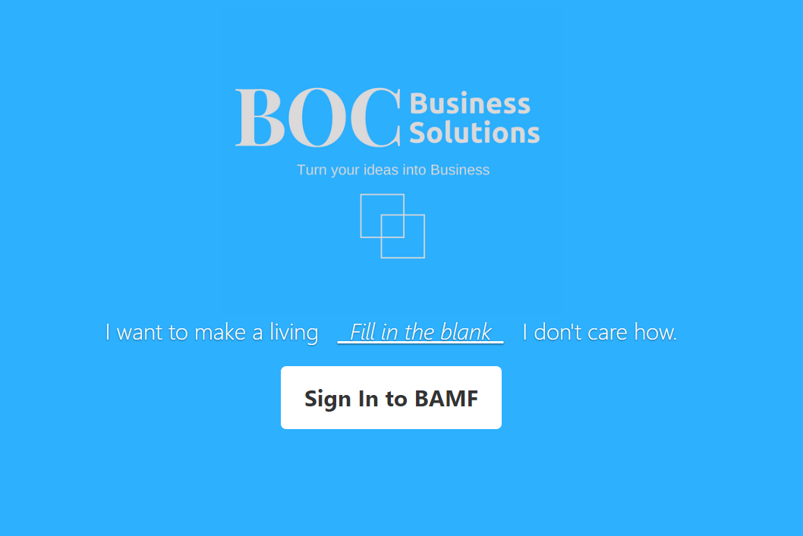

# Repository for BAMF code packages

Copy BAMF 2.0 code repository from git:
```
$ git clone https://github.com/bocbusinesssolutions/BAMF-2.0.git
```
Unzip package containing Dockerfile and image content
```
$ unzip <package.zip>
```
Run the image with the following naming convention (where x=release; y=build):
```
$ docker build -t <bocbs-xx-yyyy> .
```
Run the container with the following naming convention (where x=release; y=build):
```
$ docker run --name <bamfx.yyyy> -d -p <external port>:<internal port> <bocbs-xx-yyyy>
```



# Information for Freelance Developers

Freelance developers creating custom images for BAMF should create a local Dockerfile in the following format:
```
FROM docker pull bocbusinesssolutions/bamf2.0
MAINTAINER BOC Business Solutinos LLC <contact@bocbs.com>

<Add custom Dockerfile content here>

```
